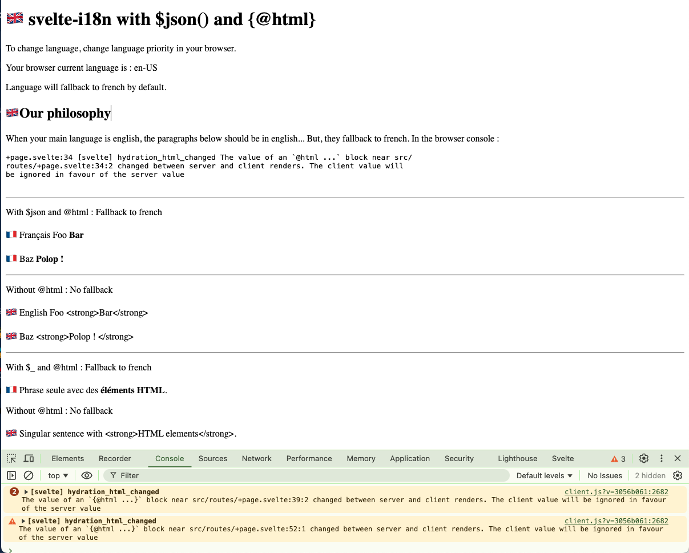

# svelte-i18n with $json() and {@html}

We are using [svelte-i18n](https://github.com/kaisermann/svelte-i18n) to translate a static site.

Using Svelte 5.

We use `$json()` from svelte-i18n to get an array from i18n json. And then, we use Svelte's `{@html}` to interpret HTML elements in the i18n strings.

The language is detected from the browser (see `src/i18n/index.ts` and `src/routes/+layout.ts`).

In this setup, french is the default language. It will fallback to this language.

When the browser language is english, regular translations are in english (ex. `<h1>` and `<h2>` headers).

But paragraphs as a `string[]` from `$json()` that are then rendered with `{@html}` 

```svelte
	{#each $json('philosophy.paragraphs') as paragraph}
		<p>{@html paragraph}</p>
	{/each}
```

```text
+page.svelte:34 [svelte] hydration_html_changedThe value of an `{@html ...}` block near src/​routes/​+page.svelte:34:2 changed between server and client renders. The client value will be ignored in favour of the server value
```

